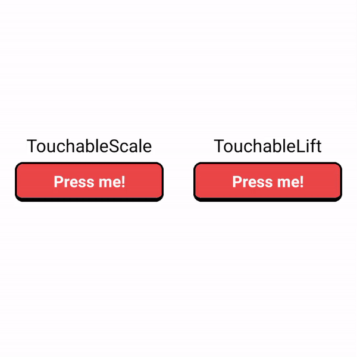

# React Native Animated Touchable Component

# Documentation

- [Example](#Example)
- [Installation](#Installation)
- [Web Support](#Web)
- [Props](#Props)
- [Usage](#Usage)

## Example

[Example](https://github.com/codingki/react-native-touchable-moti)

## Installation

This component uses [Moti](https://moti.vercel.app/), which uses Reanimated 2 so you need to install Moti and Reanimated 2.

### 1. Install Moti

    npm install moti

### 2. Install Reanimated 2

Moti requires that you install `react-native-reanimated`. The minimum version of Reanimated it's been tested on is `2.0.0-rc.0`.

#### If you're using Expo

Please follow the [Expo instructions](https://docs.expo.io/versions/latest/sdk/reanimated/#experimental-support-for-v2) for installing `react-native-reanimated` v2.

You'll need at least [Expo SDK 40](https://docs.expo.io/workflow/upgrading-expo-sdk-walkthrough/).

#### If you aren't using Expo

Please follow Reanimated's [installation instructions](https://docs.swmansion.com/react-native-reanimated/docs/installation) for v2.

### 3. Install the package

    npm install react-native-touchable-moti

## Web

Follow this instruction [https://moti.fyi/web](https://moti.fyi/web)

## Props

| Props                                                          | Required | TochableScale Default Value | TouchableLift Default Value |
| -------------------------------------------------------------- | -------- | --------------------------- | --------------------------- |
| [PressableProps](https://reactnative.dev/docs/pressable#props) |          |                             |                             |
| value                                                          | no       | 1.1                         | -10                         |

## Usage

### Import

    import { TouchableScale, TouchableLift } from  'react-native-touchable-moti';

### TouchableScale

    <TouchableScale style={styles.button} onPress={}>
        <Text style={styles.text}>Press me!</Text>
    </TouchableScale>

### TouchableLift

    <TouchableLift style={styles.button} onPress={}>
        <Text style={styles.text}>Press me!</Text>
    </TouchableLift>

You can use it as a wrapper too, like this

    <TouchableLift onPress={}>
        <View style={styles.button}>
    	    <Text style={styles.text}>Press me!</Text>
        </View>
    </TouchableLift>

Big thanks to [Fernando Rojo](https://twitter.com/fernandotherojo)

Try [Moti](https://moti.vercel.app/)

Reach me on twitter [@kikiding](https://twitter.com/kikiding)
